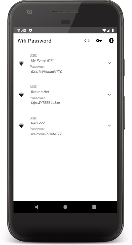
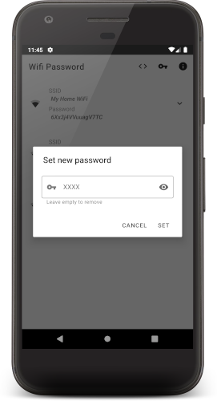
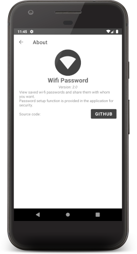

# Wi-Fi Password [ROOT]

## Description
View and share saved wi-fi passwords with Wifi Password
Easily share your passwords with everyone you want and use it to remind yourself a passwords you might forgot
Use password feature to set PIN-code for app to ensure security

## Downloads

## Screenshots

